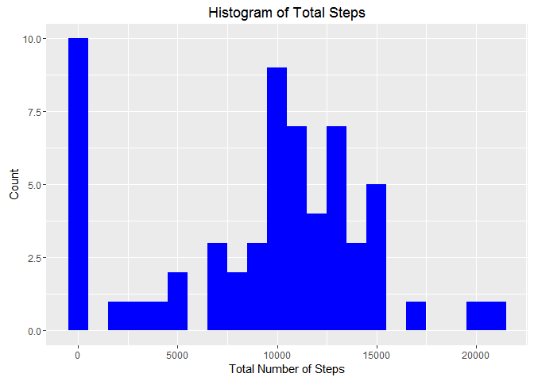
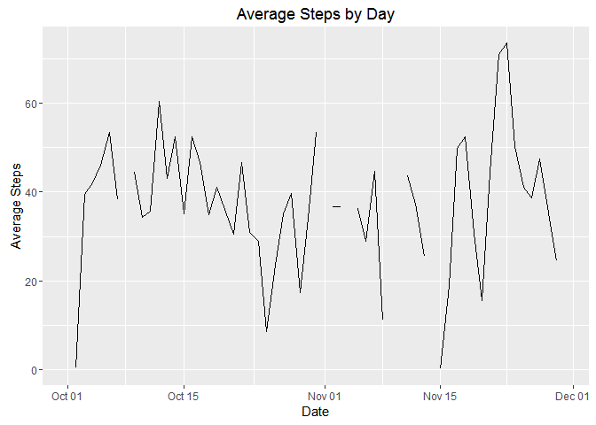
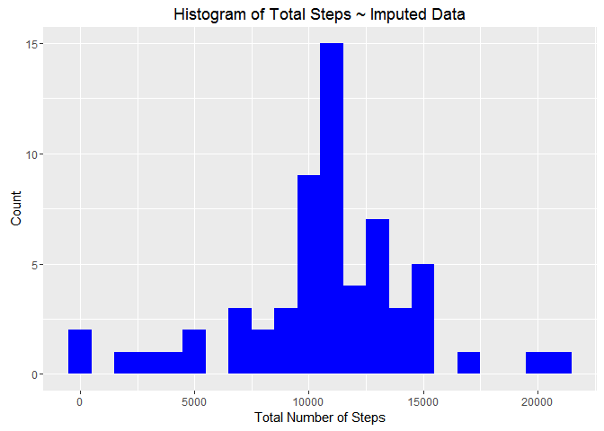
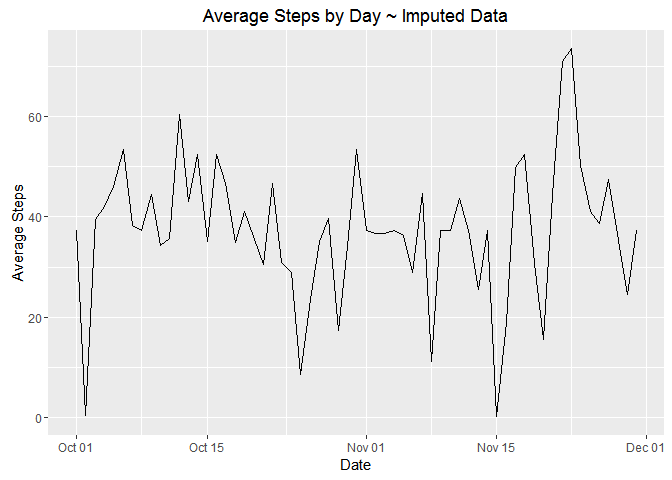
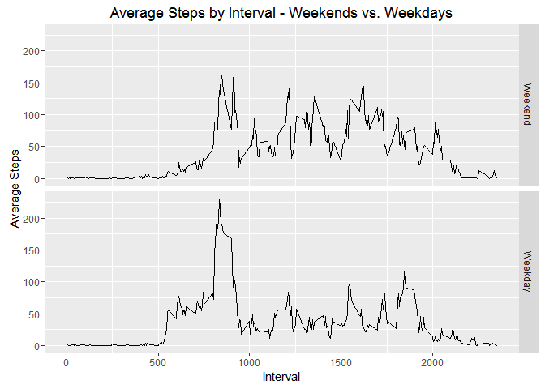

# Reproducable Research: Course Project 1 - Steps
blitz95  


# Load the ggplot2 and dplyr packages


```
## Warning: package 'ggplot2' was built under R version 3.2.5
```

```
## Warning: package 'dplyr' was built under R version 3.2.5
```


# Activity / Steps Data

The code below reads in the data from a .csv file.    


```r
activity <- read.csv("activity.csv")
```
The code below summarizes data by day


```r
#activity$dates <- as.Date(activity$date)
dates <- group_by(activity, date)
date_stats <- summarize(dates, Total = sum(steps, na.rm = TRUE), Mean = mean(steps, na.rm = TRUE), Median = median(steps, na.rm = TRUE))
date_stats$date <- as.Date(date_stats$date)
```

Below is the code that plots the histogram of total number of steps each day. The mean and median steps taken daily are also calculated.


```r
g <- ggplot(data = date_stats, aes(Total)) + geom_histogram(binwidth = 1000, fill = "blue") + labs(title = "Histogram of Total Steps", x = "Total Number of Steps", y = "Count")
print(g)
```

<!-- -->

# What is the mean total number of steps taken per day?

The mean number of steps taken each day is 9,354.2.  
The median number of steps taken each day is 10,395.  

# What is the average daily activity pattern?

Below is the code to plot a time series of the average number of steps taken per day:

```r
g2 <- ggplot(date_stats, aes(date, date_stats$Mean)) + geom_line() + labs(x = "Date", y="Average Steps") + ggtitle("Average Steps by Day")
print(g2)
```

```
## Warning: Removed 2 rows containing missing values (geom_path).
```

<!-- -->

The interval with the maximum value of steps is 615 which occurred on 2012-11-27.  This interval had 806 steps.


The previous plot and calculations were performed on the data set that contained missing values.  A new data set containing imputed values for missing values was 
created. 

# Imputing missing Values:
# Data summary using imputed values for NA values in Activity/Steps dataframe  
A summary of the activity data set shows that **2,304** of
the intervals are missing values.  

A table of NA values by date shows that there are 8 dates with missing values
for all intervals on that date.  Therefore, the values used to impute values 
were the non missing values for the interval that contained missing values.

A copy of the activity data frame was saved to activityImputed.  

A dataframe, interval_means, was created grouping by interval and calculating the mean of valid values. 

The code looped through the imputed value data frame.  NA values identified in activityImputed were replaced with the mean from the
interval_means dataframe mean value for that interval.  


```r
summary(activity)
```

```
##      steps                date          interval     
##  Min.   :  0.00   2012-10-01:  288   Min.   :   0.0  
##  1st Qu.:  0.00   2012-10-02:  288   1st Qu.: 588.8  
##  Median :  0.00   2012-10-03:  288   Median :1177.5  
##  Mean   : 37.38   2012-10-04:  288   Mean   :1177.5  
##  3rd Qu.: 12.00   2012-10-05:  288   3rd Qu.:1766.2  
##  Max.   :806.00   2012-10-06:  288   Max.   :2355.0  
##  NA's   :2304     (Other)   :15840
```

```r
table(activity$date, rowSums(is.na(activity)))
```

```
##             
##                0   1
##   2012-10-01   0 288
##   2012-10-02 288   0
##   2012-10-03 288   0
##   2012-10-04 288   0
##   2012-10-05 288   0
##   2012-10-06 288   0
##   2012-10-07 288   0
##   2012-10-08   0 288
##   2012-10-09 288   0
##   2012-10-10 288   0
##   2012-10-11 288   0
##   2012-10-12 288   0
##   2012-10-13 288   0
##   2012-10-14 288   0
##   2012-10-15 288   0
##   2012-10-16 288   0
##   2012-10-17 288   0
##   2012-10-18 288   0
##   2012-10-19 288   0
##   2012-10-20 288   0
##   2012-10-21 288   0
##   2012-10-22 288   0
##   2012-10-23 288   0
##   2012-10-24 288   0
##   2012-10-25 288   0
##   2012-10-26 288   0
##   2012-10-27 288   0
##   2012-10-28 288   0
##   2012-10-29 288   0
##   2012-10-30 288   0
##   2012-10-31 288   0
##   2012-11-01   0 288
##   2012-11-02 288   0
##   2012-11-03 288   0
##   2012-11-04   0 288
##   2012-11-05 288   0
##   2012-11-06 288   0
##   2012-11-07 288   0
##   2012-11-08 288   0
##   2012-11-09   0 288
##   2012-11-10   0 288
##   2012-11-11 288   0
##   2012-11-12 288   0
##   2012-11-13 288   0
##   2012-11-14   0 288
##   2012-11-15 288   0
##   2012-11-16 288   0
##   2012-11-17 288   0
##   2012-11-18 288   0
##   2012-11-19 288   0
##   2012-11-20 288   0
##   2012-11-21 288   0
##   2012-11-22 288   0
##   2012-11-23 288   0
##   2012-11-24 288   0
##   2012-11-25 288   0
##   2012-11-26 288   0
##   2012-11-27 288   0
##   2012-11-28 288   0
##   2012-11-29 288   0
##   2012-11-30   0 288
```

```r
#Create a dataframe to hold data with imputed values
activityImputed <- activity
# Create dataframe grouped by inteval and calculated means of intervals
intervals <- group_by(activity, interval)
interval_means <- summarize(intervals, Mean = mean(steps, na.rm = TRUE))
# Impute, assign, the mean value for the interval to intervals that have
# NA values in the activity dataframe.
for(i in 1:nrow(activityImputed)){
    if(is.na(activityImputed$steps[i]))
        activityImputed$steps[i] <- interval_means$Mean[interval_means$interval == activityImputed$interval[i]]
}
```

Using the dataframe with imputed values a histogram was created.
The mean and median were calculated.


```r
Idates <- group_by(activityImputed, date)
Idate_stats <- summarize(Idates, Total = sum(steps, na.rm = TRUE), Mean = mean(steps, na.rm = TRUE), Median = median(steps, na.rm = TRUE))
Idate_stats$date <- as.Date(Idate_stats$date)
```


```r
Ig <- ggplot(data = Idate_stats, aes(Total)) + geom_histogram(binwidth = 1000, fill = "blue") + labs(title = "Histogram of Total Steps ~ Imputed Data", x = "Total Number of Steps", y = "Count")
print(Ig)
```

<!-- -->

The mean number of steps taken each day is 10,766.2.  
The median number of steps taken each day is 10,766.2.

Including imputed values appears to have moved the mean and median to the 
same value.  

Below is code that creates a plot of a time series of the average number of steps taken per day:

```r
Ig2 <- ggplot(Idate_stats, aes(date, Idate_stats$Mean)) + geom_line() + labs(x = "Date", y="Average Steps") + ggtitle("Average Steps by Day ~ Imputed Data")
print(Ig2)
```

<!-- -->

# Are there differences in activity paterns between weekdays and weekend?

A factor variable was created to subset the data into weekend and weekday
data.  

The intervals were then plotted using the weekend/weekday factor as a facet

A character vector for weekdays was created.  

The weekdays function was used to identify the day of the week.  

This was compared to the weekday vector to categorize it as a weekday
or a weekend.


```r
weekday <- c("Monday", "Tuesday", "Wednesday", "Thursday", "Friday")
activityImputed$date <- as.Date(activityImputed$date)
activityImputed$WkDayWkEnd <- factor((weekdays(activityImputed$date) %in% weekday),levels=c(FALSE, TRUE), labels=c('Weekend', 'Weekday'))

AvgIntervalSteps <- activityImputed %>% group_by(WkDayWkEnd,interval) %>% summarize(AverageSteps = mean(steps))
```

The plot below shows the average steps per interval grouped by weekday or 
weekend.


```r
Ig3 <- ggplot(AvgIntervalSteps, aes(interval, AverageSteps)) + geom_line() + labs(x = "Interval", y="Average Steps") + ggtitle("Average Steps by Interval - Weekends vs. Weekdays") + facet_grid(WkDayWkEnd ~ .) 
print(Ig3)
```

<!-- -->

On average there appears to be less average steps taken on weekdays at later intervals in the day, but there are more average steps taken during the earlier intervals in the day on weekdays as compared to weekends.  
